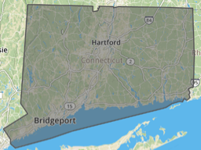
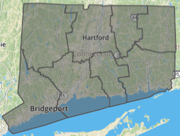
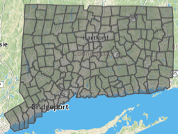
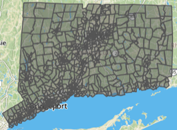
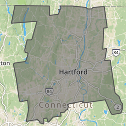
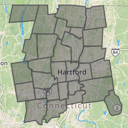
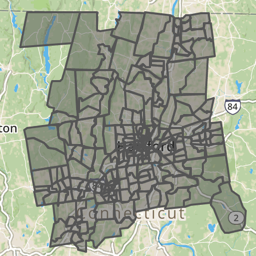
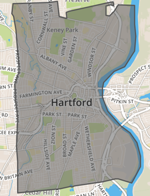
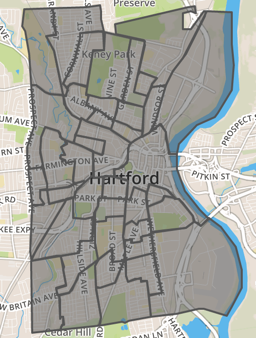
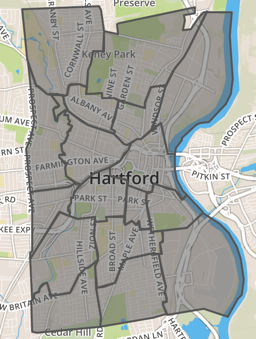

# geodata-hartford-ct
GeoJSON geographic boundary files for Hartford area, Connecticut

Originally created in 2017 by Jack Dougherty and Ilya Ilyankou for *Hands-On Data Visualization* book at https://HandsOnDataViz.org. Most files were converted from shapefile WGS 84 to GeoJSON format. Right-click the link and Save to your computer. If you accidentally open the GeoJSON code in your browser, select File > Save to download it to your computer. To view or edit, drag files into http://geojson.io or http://mapshaper.org. Learn more in [Chapter 14: Transform Your Map Data](https://handsondataviz.org/transform.html).

See more recent geodata at:
- [Hartford Open Data](https://data.hartford.gov)
- [CT Open Data](https://data.ct.gov)
- [CT Data Collaborative](https://www.ctdata.org)
- [US Census Geographies](https://www.census.gov/geographies.html)
- [Gimme Geodata by Hans Hack](http://hanshack.com/geotools/gimmegeodata/)

| Preview Geodata | Year-Source-Size  | Right-click + Save to download GeoJSON |
| :-------- | :------ | :----- |
| CT outline  | [2010 Census UConn MAGIC WGS84 1:100,000](http://magic.lib.uconn.edu/connecticut_data.html#boundaries)|  [ct-outline.geojson](data/ct-outline.geojson) |
| CT counties  | [2010 Census UConn MAGIC WGS84 1:100,000](http://magic.lib.uconn.edu/connecticut_data.html#boundaries)|  [ct-counties.geojson](data/ct-counties.geojson) |
| CT towns  | [2010 Census UConn MAGIC WGS84 simplified to 224k](http://magic.lib.uconn.edu/connecticut_data.html#boundaries)|  [ct-towns.geojson](data/ct-towns.geojson) |
| CT census tracts  | [2010 Census UConn MAGIC WGS84 1:100,000](http://magic.lib.uconn.edu/connecticut_data.html#boundaries)|  [ct-tracts-2010.geojson](data/ct-tracts-2010.geojson) |
| Hartford County outline  | [2010 Census UConn MAGIC WGS84 1:100,000](http://magic.lib.uconn.edu/connecticut_data.html#boundaries) | [hartfordcounty-outline.geojson](data/hartfordcounty-outline.geojson) |
| Hartford County towns  | [2010 Census UConn MAGIC WGS84 1:100,000](http://magic.lib.uconn.edu/connecticut_data.html#boundaries) | [hartfordcounty-towns.geojson](data/hartfordcounty-towns.geojson) |
| Hartford County tracts  | [2010 Census UConn MAGIC WGS84 1:100,000](http://magic.lib.uconn.edu/connecticut_data.html#boundaries) | [hartfordcounty-tracts-2010.geojson](data/hartfordcounty-tracts-2010.geojson) |
| Hartford outline  | [2010 Census UConn MAGIC WGS84 1:100,000](http://magic.lib.uconn.edu/connecticut_data.html#boundaries) | [hartford-outline.geojson](data/hartford-outline.geojson) |
| Hartford census tracts  | [2010 Census UConn MAGIC WGS84 1:100,000](http://magic.lib.uconn.edu/connecticut_data.html#boundaries) | [hartford-tracts-2010.geojson](data/hartford-tracts-2010.geojson) |
| Hartford neighborhoods  | [2015 Hartford Open Data 1:50,000](http://gisdata.hartford.gov/datasets/d3deb11bfd9242ce9c927187c512da9e_5) | [hartford-neighborhoods.geojson](data/hartford-neighborhoods.geojson) |
